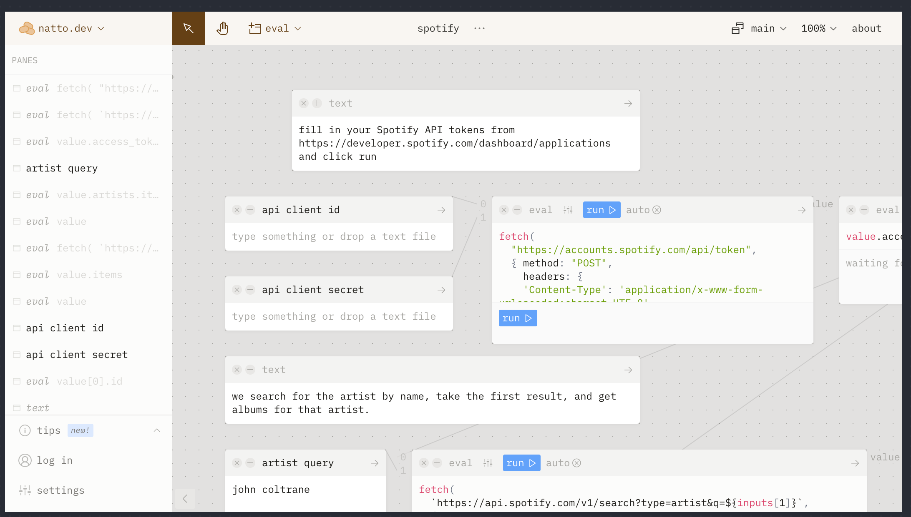
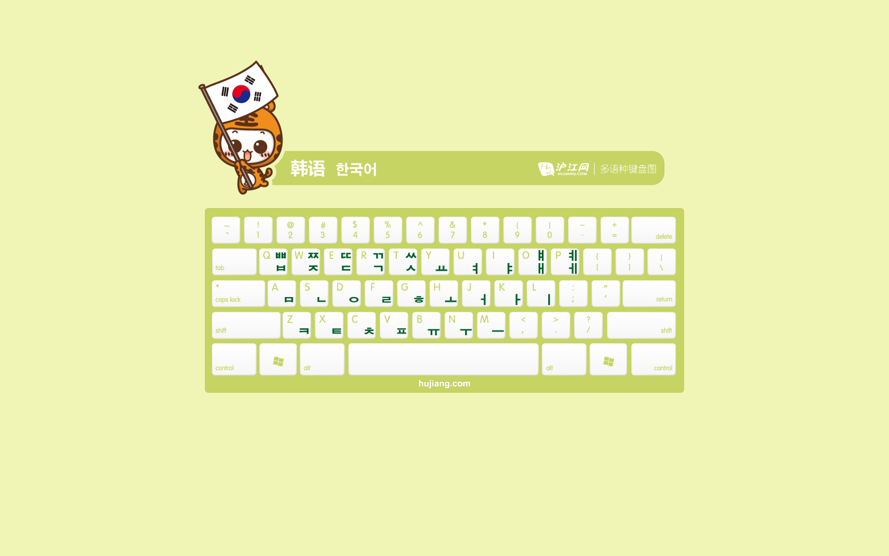
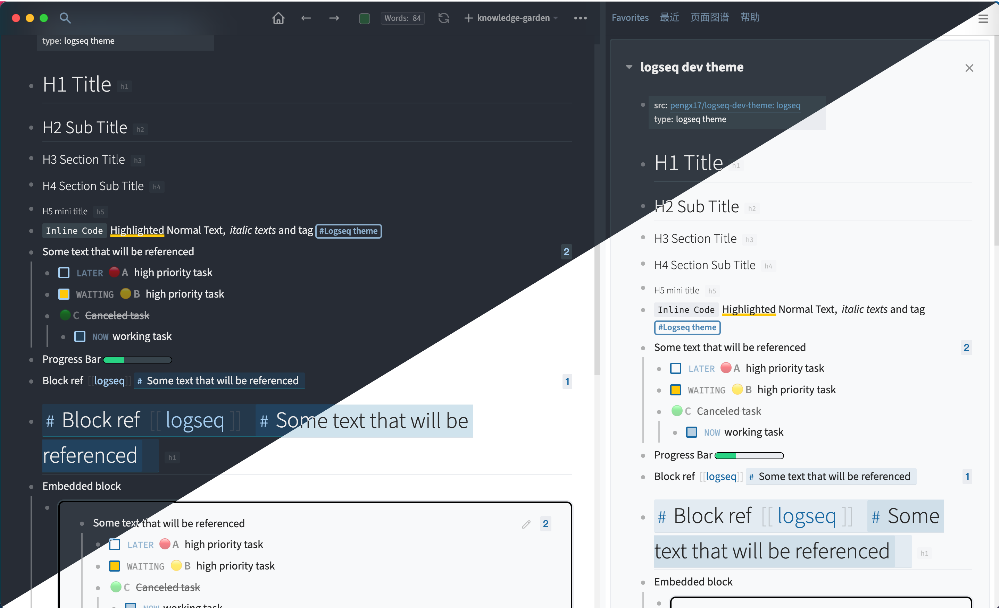

src:: [pengx17/logseq-dev-theme: logseq](https://github.com/pengx17/logseq-dev-theme)
type:: logseq theme

# H1 Title
- ## H2 Sub Title
- ## 二级标题
-
- ### H3 Section Title
- ### 三级标题
-
#### H4 Section Sub Title
id:: 610173e1-964e-4fe6-8e57-ac177a2f1522
##### H5 mini title
- `Inline Code` ^^Highlighted^^ Normal Text,  _italic texts_ and tag #[[Logseq theme]]
- Some text that will be referenced
  id:: 60d34662-6747-46cd-a790-6dcb691b0256
	- LATER [#A] high priority task
	  waiting:: 1624459006771
	  later:: 1624459014212
	  :LOGBOOK:
	  CLOCK: [2022-01-19 Wed 21:15:38]--[2022-01-19 Wed 21:15:39] =>  00:00:01
	  :END:
	- WAITING [#B] high priority task
	  done:: 1624458986941
	  now:: 1624458985140
	  later:: 1624458989486
	  waiting:: 1624459000961
	- CANCELED [#C] Canceled task
	  collapsed:: true
		- NOW working task
		  later:: 1624459087696
		  now:: 1624459089292
- Progress Bar [:progress {:max 10 :value 3}]
- Block ref  [[Logseq]] ((60d34662-6747-46cd-a790-6dcb691b0256))
  id:: 610173e1-6229-4cc1-85d9-b652d28d888a
# ((610173e1-6229-4cc1-85d9-b652d28d888a))
- Embedded block (())
	-
	- {{embed ((60d34662-6747-46cd-a790-6dcb691b0256))}}
		- {{embed [[Microsoft]]}}
- [[汉字测试]]
- IMAGE
	-
	- {:height 285, :width 467}
	- 
- 